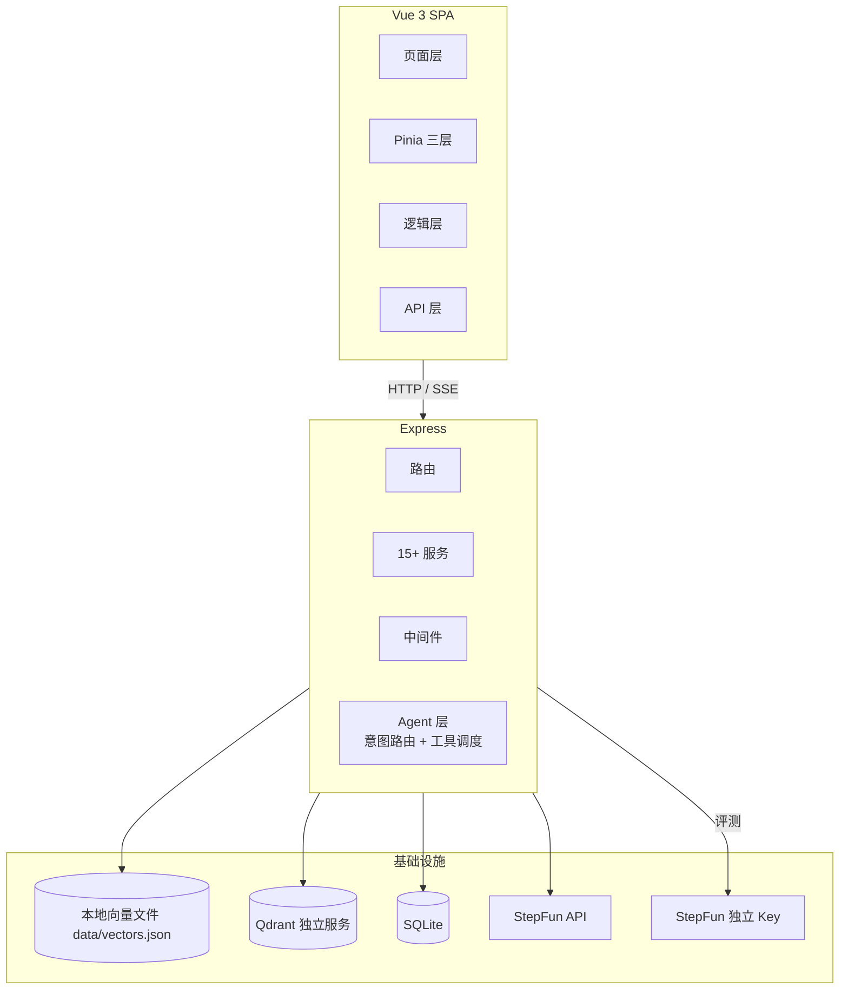

# 武理小精灵 RAG 系统 — 架构与调优记录

## 项目概述

武理小精灵是一个基于 RAG 的武汉理工大学校园知识问答系统。前端 Vue 3 + Pinia SPA，后端 Express，向量库默认 Qdrant 独立服务（2026-08-10 起，本地文件持久化版保留可切换），Embedding BGE-small-zh（本地 ONNX），Reranker BGE-reranker-base（本地 ONNX cross-encoder），LLM StepFun step-3.7-flash，评测独立使用 step-3.5-flash + 独立 API Key。

## 整体架构



## 架构

### 当前检索链路（2026-08-10）

```
用户提问
  ↓
BGE-small-zh ONNX → 稠密 512d + n-gram 稀疏向量（整数 key 哈希）
  ↓
Qdrant 独立服务检索 (topK=50)（唯一后端，本地文件持久化版已移除）
  融合：weighted（0.6·dense + 0.4·sparse，通道内归一化，官方评测 80.7% recall 优于 RRF 74.5%）
  ↓
50 句子 → 按 parentId 归并 → ~15 个父段落
  ↓
BGE-reranker-base cross-encoder 逐对打分 → sigmoid
  ↓
自适应截断（断崖>0.05 + 低分<0.3 + 硬上限=rerankTopK）
  ↓
二级排序 (docId, parentIdx)
  ↓
上下文组装 max 6000 字
  ↓
StepFun step-3.7-flash → 回复 + sources
```

### 父子段落架构

```
文档 → 章节合并(按 一、二、三 标题) → 段落(父级) → 子块(按块型自适应)
检索命中子块 → 按 parentId 去重 → BGE-reranker 排序 → 自适应截断 → LLM 上下文
```

子块粒度场景化（`DOC_ADAPTIVE_CHUNKING`，默认开）：散文仍为 25 字符句子包（语义聚焦）；
FAQ 问答整条一个子块（题目行/问号行开条目，选项答案归条目，防召回串台）；
Markdown 表格 ≤5 数据行整表一个子块、大表按行切且每行带表头前缀；
列表按条目边界切且条目带引导句标题前缀（步骤归属）；条目超 150 字退回句子合并。
检索命中粒度变了，LLM 看到的仍是完整父段落。

### 状态管理架构

```
chat.store（聚合层）→ 页面统一接口
  ├─ conversation.store（会话数据：列表、缓存、后端同步）
  └─ message.store（流式过程：loading、streamingId、发送/重试/中断）
       └─ useStreaming composable（SSE 解析、RAF 合并、重连、后台 Tab 兜底）
```

### Agent 架构（V2.0：意图路由 + 工具调度）

> 2026-07-21 曾移除早期 Agent 系统（存档 `D:\武理小精灵_agent_存档`），V2.0 重新引入并裁剪。
> 当前状态：工具调度默认启用，`AGENT_TOOL_ENABLED=false` 可一键回退 RAG；意图路由默认开，LLM 分类仍默认关（避免每条消息多一次分类调用）。

```
用户消息
  ↓ 意图路由 intent-router.service.js
  ├─ fastRoute（零成本 ~0ms，不调 LLM）
  │    问候/感谢/告别 → route: chat（纯 LLM，不触发检索）
  │    明确多步任务（规划/分析/对比/权衡…）→ route: agent
  │    明确数学表达式 + 计算提示 → route: agent / calculate
  │    其余模糊意图 → null（不硬路由，减少误判面）
  ├─ classify（LLM 分类兜底，INTENT_CLASSIFY_ENABLED=true 才启用）
  │    15s 超时 + JSON 解析失败 → 兜底，不阻塞
  └─ 兜底 _fallbackRoute → route: chat（未命中高置信知识意图时不强制检索）
  ↓
  ConversationOrchestrator 注入持久记忆并统一编排：
  route=chat  → AiService 纯 LLM
  route=agent → AgentService 工具调度（L2 有界多轮）
  route=rag   → RagService 检索管道（Wiki/Qdrant 混合，Wiki stale 时自动排除）
  SSE 事件：intent / tool_call / tool_result / trace（前端展示"自动路由：知识库检索"）
```

**L2 有界多轮工具调度（agent.service.js，maxToolRounds=2）**

```
每轮：LLM 决策（OpenAI function calling 格式）
  ├─ 无工具调用 → 直接回答，收尾
  └─ 有工具调用 → 下发 tool_call 事件 → runTool 执行（超时闸门）
                  → tool_result 事件 → 回注 tool 角色消息 → 下一轮
防失控设计：
  ├─ 轮次上限 maxToolRounds=2（AGENT_MAX_TOOL_ROUNDS 可调）
  ├─ 无进展检测：连续 2 轮相同工具+参数签名 → 强制收尾
  ├─ 收尾生成不带 tools，杜绝继续调工具
  └─ 每轮决策/执行超时 15s（AGENT_DECIDE_TIMEOUT_MS / AGENT_TOOL_TIMEOUT_MS）
```

**工具注册表（agent-tools.js + tool-registry.service.js，可扩展）**

| 工具 | 能力 | 超时 |
|------|------|------|
| `search_knowledge_base` | 复用 rag.service 全链路检索（支持 category 过滤） | 15s |
| `read_tool_artifact` | 按 opaque artifactId 读取当前运行的大型工具结果 | 3s |
| `calculate` | mathjs 安全求值（模块级 create(all)，防注入） | 3s |

教务系工具（查成绩/课表等）因无教务系统接入未移植。

**L3 记忆系统**：`ConversationOrchestrator` 调用 `MemoryService.buildMemoryContext()`，将用户画像、相关长期记忆和短期摘要作为 system history 注入 Chat/RAG/Agent；Agent 内部仍通过 `buildMemorySummary` 处理最近会话指代。长期记忆 embedding 在序列化前完成，并通过用户级写队列避免进程内并发覆盖。

**L4 agent tracer（可观测性）**：每轮记录 rounds / toolCalls（名称、参数、成败、耗时）/ totalMs / finishReason（direct_answer | round_limit | no_progress | error），结束随 SSE 下发。

### 评测体系

```
离线测试集（32 题，覆盖 6 文档）
  ├─ eval-retrieval.js → Recall/Precision/MRR/nDCG
  ├─ eval-ragas.js → LLM-as-judge（独立 Key + step-3.5-flash）
  │   ├─ 失败降级 → 关键词匹配
  │   └─ 双判抽样 judge-agreement.service.js → 每 10 条抽 1 条复判（JUDGE_DOUBLE_JUDGE_RATIO），
  │      两次四指标差均 ≤0.1 判"一致"，一致率/平均分歧随评测返回（抽中样本取均值降方差）
  ├─ 人工抽检 EvalScoring.vue → 1-5 分
  └─ 线上反馈 RagFeedback.vue → like/dislike 统计
回归评估：基线比对，指标变化 > 2% 告警
```

## 涉及文件

### 前端核心
- `src/views/AIChat.vue` — 主聊天页
- `src/stores/chat.store.js` — 聚合 store
- `src/stores/conversation.store.js` — 会话数据
- `src/stores/message.store.js` — 流式状态
- `src/composables/useStreaming.js` — SSE 流式
- `src/utils/markdownRendererCore.js` — 模块级 MarkdownIt 单例 + DOMPurify 消毒（MarkdownRenderer.vue 在此之上叠加引用徽标与搜索高亮）
- `src/api/chat.js` — 流式 API + 连接管理
- `src/components/chat/ChatBox.vue` — 输入框/语音/文件上传
- `src/components/chat/MessageList.vue` — 消息列表
- `src/views/WikiBrowse.vue` / `src/views/WikiEntry.vue` — 校园百科列表与词条阅读页（正文复用 MarkdownRenderer）
- `src/composables/useWiki.js` — 词条列表模块级缓存（30s TTL + `invalidateWikiEntries()` 显式失效）、服务端搜索防抖、上下架
- `src/utils/wikiTree.js` — 从实际入库分类反推分类树、词条路径（slug 优先、未上架回退 id）
- `src/constants/wiki-categories.js` — 两级分类体系唯一定义处（后端对 category 无白名单校验，展示口径以此为准）
- `src/components/chat/MarkdownRenderer.vue` — Markdown 组件
- `src/components/chat/VoiceRecorder.vue` — 语音输入

### 后端核心
- `indexing.service.js` — 段落→子块两层切片 + 中文章节合并 + 场景化子块（FAQ 整条/表格整表或按行/列表按条目，`DOC_ADAPTIVE_CHUNKING`）
- `vector-store-qdrant.service.js` — Qdrant 独立服务（默认，dense+sparse 双查询 + 加权融合）
- `vector-store.service.js` — 本地文件持久化 + 精确相似度检索（稠密+稀疏混合，可切换）
- `embedding.service.js` — BGE-small-zh ONNX + n-gram 稀疏（整数 key）
- `reranker.service.js` — BGE-reranker-base cross-encoder
- `rag.service.js` — RAG 门面：公开 API（chat/chatStream/localSearchChat/retrieve*）+ 管道与生成层编排 + 兼容 shim
- `rag-pipeline.service.js` — RAG 检索管道编排：文档检查 → 多变体检索 → 可靠性判定 → 父段处理（聚合/rerank/截断/MMR/排序/组装）
- `rag-generation.service.js` — RAG 生成层：非流式/流式 LLM 生成、失败守卫与纯 LLM 降级、grounding/process 卡片/usage/追问收尾
- `ai.service.js` — LLM 调用 + 请求队列（LLM_CONCURRENCY=3）
- `ocr.service.js` — 视觉识别（step-1o-turbo-vision）：图片/扫描件 → Markdown，mupdf 渲染 + 页级并发，支持按页 OCR（opts.pages/returnMap，文本型 PDF 表格页重建用）
- `judge.service.js` — LLM-as-judge 独立 Key，4 指标合并 1 次请求
- `prometheus-metrics.service.js` — Prometheus 文本格式渲染（零依赖）：运营计数器 + 有界原始延迟样本现场分桶直方图 + 进程/事件循环自观测，`/api/metrics/prometheus` env 门控 + token 校验，抓取方放外部
- `otel-tracing.service.js` — OTLP trace 导出（env 门控，`OTEL_EXPORTER_OTLP_ENDPOINT` 设置即启用）：手动埋点三处——middleware HTTP 根 span（http.* 语义属性）、`RagTracer.recordStage` 单点接线全部 RAG 阶段子 span（显式时间戳）、ai.service 非流式/流式 LLM span（gen_ai.* 属性）；关闭时 `@opentelemetry/api` 走 Noop，零依赖加载
- `intent-router.service.js` — 意图路由（V2.0）：fastRoute 零成本关键词 + LLM 分类兜底（默认关）+ 未命中时 chat 兜底
- `wiki.service.js` — 校园百科治理层：以知识库 `document:<docId>` 为唯一正文源，服务端解析 front-matter、正文修订/stale、模拟语料判定（禁止上架）、上下架元数据与 slug 别名存 `wiki:entries`/`wiki:slugs` 两个 hash；RAG 命中时可与 Qdrant 候选混合
- `agent.service.js` — Agent 工具调度（V2.0）：L2 有界多轮（maxToolRounds=2 + 无进展检测）+ L3 会话记忆摘要 + 工件落盘/按需读取 + L4 agent tracer
- `agent-tools.js` — Agent 工具注册表：search_knowledge_base + read_tool_artifact + calculate（mathjs 安全求值）
- `conversation-orchestrator.service.js` — Chat/RAG/Agent 统一编排、持久记忆注入、失败降级与结果保存
- `tool-registry.service.js` — JSON Schema 参数校验、取消传播、超时闸门与工具元数据
- `tool-registry.service.js` — 工具注册器（TOOL_SOURCES.BUILTIN，可扩展）
- `config/index.js` — 集中配置

### 评测
- `scripts/rag-eval/eval-retrieval.js` — 检索指标评测
- `scripts/rag-eval/eval-ragas.js` — RAGAS 评测
- `scripts/rag-eval/dataset/` — 5 套测试集
- `scripts/rag-eval/results/` — 评测结果

## 调优历程

### ✅ 已完成

**1. 存储层修复：Redis Cloud → MemoryStore（2025-07-13）**
- 问题：Redis Cloud 跨太平洋 hgetall 2-3s，单次 RAG 55s
- 修复：注释 REDIS_URL，使用本地 MemoryStore
- 效果：listDocuments 32s → 5ms

**2. Embedding：n-gram → BGE-small-zh ONNX（2025-07-13）**
- 问题：BGE-M3 API 失效，降级到 n-gram 哈希，无语义理解
- 修复：集成 @xenova/transformers，加载 Xenova/bge-small-zh-v1.5（24MB, 512d）

**3. 父子段落检索（2025-07-13）**
- 句子级向量化 → 段落级上下文注入
- 上下文 ~6000 字 → ~300 字（降 95%）

**4. 段落碎片化修复：章节合并（2025-07-14）**
- mammoth 提取 258 短段落 → 按中文章节标题合并 → 21 语义块
- 涉及：indexing.service.js — _mergeBySection()

**5. BGE-reranker-base 集成（2025-07-14）**
- 替换 2-gram 关键词精排为 cross-encoder 语义精排
- INT8 ONNX (~278MB)，~145ms/15 候选

**6. 稀疏向量格式修复（2025-07-14）**
- _localSparse() 输出 { "b:学校": 1 } 字符串 key → Milvus 不兼容（NaN）
- 改为哈希到整数 key：{ 123456: 1, 789012: 2 }，符合 Milvus SparseFloatVector 格式

**7. 自适应截断 + 二级排序（2025-07-14）**
- 断崖检测（分差 > 0.05 截断）+ 低分过滤（< 0.3）+ 硬上限 rerankTopK
- 二级排序 (docId, parentIdx) 让上下文按阅读顺序排列

**8. Milvus 集合加载修复（2025-07-14）**
- 创建索引后需 loadCollectionSync()，否则报 "collection not loaded"
- WeightedRanker 参数改为数组 [0.6, 0.4]

**9. LLM-as-judge 独立 Key 隔离（2025-07-24）**
- 问题：评测和生产共用 API Key，5 并发/10 RPM 互相抢占，限流导致有效样本少
- 修复：独立 JUDGE_API_KEY + JUDGE_MODEL=step-3.5-flash
- 4 指标合并到 1 次请求，128 次 → 32 次
- 失败自动降级关键词匹配

**10. 父段 MMR 去重 + 元数据过滤（2026-08-08）**
- 问题：评测显示学校概况类 pass 仅 36%，具体事实（食堂数、社团数）不在 top 5 段；rerankTopK=5 时同文档相似段落挤占上下文
- 修复 A：父段归并后 MMR 去重（`_mmrDedupe`）
  - 字符 bigram Jaccard 相似度（零模型调用），`λ·relevance − (1−λ)·maxSim(selected)` 贪心选择
  - 与已选父段相似度 ≥ 0.85 视为冗余直接剔除；RAG_MMR_ENABLED / RAG_MMR_LAMBDA / RAG_MMR_MAX_SIM
  - 接入 localSearchChat（截断后）与 assembleParentContext（流式路径）
- 修复 B：元数据过滤（Multi-faceted Filtering，`_inferDocCategory`）
  - 问题关键词命中 ≥ 2 个类别词 → 自动推断文档类别（学校概况/专业课程/面试刷题/AI学习）并作为 search filter
  - 低置信度返回 null 不设过滤（保全库召回）；自动过滤空结果时回退全库检索（防跨文档问题误伤）
  - RAG_AUTO_CATEGORY_FILTER 开关，trace 记录 autoCategory / filterFallback
- ⚠️ 回归（2026-08-09 官方评测）：MMR 去重导致跨文档 recall 显著下降
  - full-coverage 32 题同链路对比：加权+MMR默认 **Recall 80.7%**；关闭 MMR 后 **97.4%**（历史基线 99.0%，基线评测时无 MMR）
  - 根因：doc_9a78 与 doc_4dcd 父段 bigram Jaccard 相似度 = 1.0（内容几乎相同），`相似度≥0.85 直接剔除` 把**第二个相关文档整体剔掉**（C01-C08 全部只命中 1 个相关 doc、漏 doc_9a78）
- ✅ 修复（2026-08-09）：相似度剔除仅限**同 docId 内**父段，跨文档高度相似不再剔除（`_mmrDedupe` 中 maxSim 只统计 docId 相同的已选父段）
  - 保留原设计目标：解决"同文档相似段落挤占上下文"；同时保住多文档问题的第二个相关文档
  - 修复后官方评测（加权+新 MMR）：**Recall 97.4%**、MRR 0.977、nDCG@5 0.970、HitRate 100%
  - 学校概况类 48.5% → **97.0%**；C01-C08 全部 100% 命中（不再漏 doc_9a78）
  - 测试：rag.mmr-category.test.js 新增"跨文档高度相似不剔除"用例，后端全量 131 用例通过

**11. 混合检索融合：加权打分 → RRF → 回退加权（2026-08-09）**
- 问题：稠密 cosine 与稀疏 cosine 量纲/分布不可比，0.6/0.4 加权需要反复校准，项目此前为此加了 `_terminality` 动态调权补丁
- 尝试 A：`vector-store.service.js` search() 改为 RRF（Reciprocal Rank Fusion）
  - 稠密/稀疏两通道各自按分数独立排名，`score = Σ 1/(k + rank)`，k 默认 60（RAG_RRF_K 可调）
  - 0 分视为该通道未命中不参与排名；trace 保留 _vectorScore/_sparseScore/_retrievalChannels
  - 同步清理：删除 `_terminality` 动态权重路由与 rag.vectorWeight/keywordWeight 配置；`fuseRetrievalResults` 一并改纯 RRF
- 实测（2026-08-09，full-coverage-qa.json 32 题，同链路同数据集，测试账号跑官方评测）：

  | 指标 | RRF(k=60) | 加权(0.6/0.4) |
  |------|:---:|:---:|
  | Recall | 74.5% | **80.7%** |
  | MRR | 0.914 | **0.977** |
  | nDCG@5 | 0.777 | **0.840** |
  | HitRate | 93.8% | **100.0%** |
  | 按类别 recall | 学校概况 48.5% / 专业课程 86.4% / 面试刷题 80% / AI学习 100% | 学校概况 48.5% / 专业课程 **95.5%** / 面试刷题 **100%** / AI学习 100% |

  结论：**加权全面优于 RRF**（专业课程、面试刷题类提升最明显）。离线融合层 A/B 曾显示两者几乎持平（Recall@5 96.9% vs 100%），但官方全链路评测（含 reranker）拉开差距——RRF 稀疏通道的噪声排名干扰了后续 rerank。
- 🔬 k 值影响复测（2026-08-09，`offline-rrf-ab.cjs 10 20 40 60` 离线融合层 + 官方评测）：

  | 融合方式 | 离线 Recall@5 | 离线 MRR | 离线 nDCG@5 | 官方 Recall | 官方 MRR | 官方 nDCG@5 |
  |------|:---:|:---:|:---:|:---:|:---:|:---:|
  | 加权(0.6/0.4) | 100.0% | 0.964 | 0.967 | 97.4% | 0.977 | 0.970 |
  | RRF(k=10) | 100.0% | **0.979** | **0.981** | 97.4% | **0.984** | **0.974** |
  | RRF(k=20) | 100.0% | 0.977 | 0.978 | — | — | — |
  | RRF(k=40) | 100.0% | 0.975 | 0.975 | — | — | — |
  | RRF(k=60) | 96.9% | 0.974 | 0.963 | 74.5%* | 0.914* | 0.777* |

  \* 官方 RRF(k=60) 为 MMR 回归修复前跑的数据（当时含 MMR 跨文档剔除回归），与其它行不完全同链路。
  - 结论修正：**RRF 表现差主要是 k=60 偏大**（排名差异被过度压扁，CT05 掉出 top5）；k=10 的 RRF 与加权打平（官方 Recall 同为 97.4%，MRR/nDCG@5 微弱领先 0.007/0.004，属噪声级差异）
  - 维持默认 weighted：效果相同但零超参、更简单（RRF 备选实现已随文件版向量库移除）
- RRF 排名融合实现与 `rag.weights.test.js` 已随文件版向量库一并移除（加权融合为唯一实现）
- ⚠️ 排坑：RRF 排名必须按**句子唯一 id**（chunk id）计 rank，不能按 docId——同一 doc 的多条句子会相互覆盖，导致 RRF 被严重低估（曾出现 recall 100%→53% 的假象）

**12. 前端性能指标埋点 + 简历数据实测（2026-08-12）**
- 为简历补充前端性能数据，新增两处统计埋点（均走真实代码路径）：
  - `useMarkdownRenderer.js`：渲染缓存命中率统计（hit/miss 计数 + localStorage 持久化 `markdown_cache_stats` + 每 50 次渲染输出 `[MarkdownCache]` 日志）
  - `VoiceRecorder.vue`：识别成功率统计（会话级：产出 final 转写 → success；onerror 除 aborted 外 → fail；localStorage `voice_recognition_stats` + `[VoiceStats]` 日志）
- 命中率实测（vitest 模拟典型聊天场景，走真实 `renderMarkdownMain`，3 场景各渲染 100 次）：
  - 流式为主场景：原始命中率 22%（流式 chunk 内容实时变化天然 miss），**重复渲染命中率 95.7%**
  - 历史回看/虚拟滚动 remount：95.0%；同一内容反复渲染：99.0%
  - ⚠️ 口径：简历写"重复渲染命中率 95%+"即可，不能写总命中率（含流式增量仅 22%）
- SSE 首包响应实测（生产环境 `measure-rag-stream.cjs`，4 轮）：
  - HTTP 建连 ~67-88ms；retrieval 事件（SSE 首包）典型 **115-131ms**（一轮异常 432ms）；首个 content（首 token，含 LLM 思考）5.9-7.6s
  - ⚠️ 口径：简历写"SSE 首包 ~130ms（<150ms）"；前端 `chat.js` 的 TTFT 埋点测的是首个 content（≈6s），两者不可混用
- 测试：`src/__tests__/markdownCacheHitRate.test.js`（3 场景命中率）、`src/__tests__/voiceRecorderStats.test.js`（成功率 + localStorage 持久化，假 recognition 模拟）

**13. 扫描件 OCR + 图片表格识别（2026-08-12）**
- 问题：① pdf-parse 对扫描件 PDF 提不出文本（无文本层），上传直接报"文件内容为空"；② 聊天图片上传只存 URL 不解析，图片（含表格截图）进不了 RAG 链路
- 方案：新增 `ocr.service.js`，走 StepFun `step-1o-turbo-vision`（OpenAI 兼容 `image_url` + `detail` 参数，零新依赖，复用 AI_API_KEY）
  - `recognizeImage(buffer, mime)`：图片 → 结构化 Markdown（prompt 强制表格转 Markdown 表格语法，保留行列结构）
  - `ocrPdf(filePath)`：mupdf 逐页渲染 PNG（`Matrix.scale(2,2)` + DeviceRGB）→ 页级并发（默认 2）逐页识别 → 按"第 N 页"合并
- 接入：`file-upload.service.js` `parsePDF` 先 pdf-parse 文本层，提取 < `OCR_PDF_MIN_CHARS`(30) 字判定扫描件 → 自动降级 OCR；`parseFile` 新增图片分支；`register.js` 聊天上传图片也走识别，失败降级 null 不阻塞上传
- 成本闸门：`detail=low` 每图约 169 token（表格场景可切 high）、`OCR_MAX_PAGES`(30) 页数封顶、`OCR_ENABLED` 总开关，关闭时退回原行为
- ⚠️ 排坑：vitest 4 中 `vi.mock` 对 CJS `require` 链不生效（ESM import 生效、CJS require 不生效），测试改 `vi.stubEnv` + `delete require.cache` + 动态 import 重建服务实例；mupdf 1.28 为 ESM-only，CJS 中用动态 `import('mupdf')` 懒加载
- 测试：`backend/__tests__/ocr.service.test.js`（4 用例：未启用/无 Key 降级、detail 默认与覆盖）；后端全量 135 用例通过

**14. 文本型 PDF 表格页检测 + 按页 OCR 重建（2026-08-13）**
- 问题：pdf-parse 对表格只输出纯文本流，**行列结构丢失**（表格截图/扫描件已由视觉模型保留 Markdown 表格，文本型 PDF 是唯一缺口）。此前认知是"需引入专用表格结构识别模型（Table Transformer）"，实际**复用已有视觉模型即可**——缺的不是识别能力，而是"哪些页有表格"的廉价检测器
- 方案 A（落地）：文本层启发式检测表格页 → 命中页按页渲染走 `step-1o-turbo-vision` 重建 Markdown 表格
  - `ocrPdf` 扩展：支持 `opts.pages`（0-based 页索引数组，越界忽略/去重/升序）与 `opts.returnMap`（返回 `[{pageIndex, text}]` 便于按页替换）；默认仍全页识别，向后兼容
  - 新增纯函数（`file-upload.service.js`，零 API 成本）：`detectTablePages(text)` 按 `\f` 分页后逐页判断；`isTableLikePage` 四个启发式信号——① `|` 竖线密度 ≥3 行 ② ASCII 分隔符行（`----`/`+---+`/`====`）≥2 ③ 列对齐（同一字段数 ≥4 行且多字段行 ≥5）④ 表头关键词（序号/名称/数量…）+ 多字段行 ≥2；`replaceTablePages` 将 OCR 结果按页替换回原文（页间以 `\f` 分隔）
  - 接入：`parsePDF` 第三步——检测命中页 → `ocrPdf(filePath, { pages, returnMap: true })` → 整页替换（视觉模型输出含整页 Markdown）；**失败/关闭回退原文，不阻塞入库**；无分页符（`\f` 缺失）时不做按页 OCR，避免整本误伤
- 成本：仅命中页 × ~169 token/页（detail=low），复用 `OCR_MAX_PAGES`/`OCR_CONCURRENCY` 闸门；`OCR_TABLE_ENABLED`（默认 true）总开关，false 时退回原行为
- 测试：`backend/__tests__/table-detect.test.js`（12 用例：三信号检测/纯文本不误报/按页替换/越界忽略/配置开关）；后端全量 **147** 用例通过

**15. Agent V2.0：意图路由 + 工具调度（2026-08-14）**
- 背景：2026-07-21 曾移除早期 Agent 系统（存档 `D:\武理小精灵_agent_存档`，当时因工具不全/延迟高回归纯 RAG）；V2.0 重新引入并裁剪
- 意图路由（`intent-router.service.js`）：fastRoute 零成本关键词（问候→chat、多步任务→agent、明确计算→agent/calculate，其余不硬路由防误判）+ LLM 分类兜底（默认关，`INTENT_CLASSIFY_ENABLED`）+ 未命中时 chat；`INTENT_ROUTING_ENABLED=false` 退回原链路
- L2 有界多轮（`agent.service.js`）：maxToolRounds=2（默认）+ 无进展检测（连续 2 轮相同签名强制收尾）+ 收尾生成不带 tools + 决策/执行超时 15s，杜绝无限循环
- 工具裁剪：`search_knowledge_base` + `read_tool_artifact` + `calculate`，大型结果使用 opaque 工件和 owner/run 校验；教务系工具无接入不移植
- L3 会话记忆（buildMemorySummary）+ L4 agent tracer（轮次/工具/耗时/收尾原因随 SSE 下发）
- 回退开关：`AGENT_TOOL_ENABLED=false` 时 agent 路由自动进入 RAG，便于出现上游异常时快速止损

**16. Agent 链路结构性优化（2026-08-15）**
- 背景：代码审查发现 agent 链路 12 个可提升点，本次全部修复，核心是消除"双重生成"与补齐灰度所需的观测/评测
- ① 拆分检索与生成（消除双重生成）：`rag.service.js` `localSearchChat` 新增 `retrieveOnly` 选项——只检索不生成；`search_knowledge_base` 工具改调 retrieveOnly，返回 `{ content, data: { sources } }`。修复前 agent 请求 = 决策 LLM + RAG 内部 LLM + 收尾 LLM 共 3 次调用，修复后 = 决策 + 收尾 2 次，且 sources 不再丢失
- ② sources 透传：agent 链路新增 `sources` SSE 事件（`mergeSources` 按 docId/title 去重），控制器写入与 RAG 路径相同形状的 `sources` 事件，agent 路径也能展示引用来源；非流式 `chat()` 返回 `sources` + `trace`
- ③ 单一调度实现：`chat()` 改为 drain `chatStream()` generator，删除第二套循环逻辑（drift 风险）；`decide()` 保留（单轮决策 API，agent 评测脚本复用）
- ④ trace 正确性：`toolCalls[].durationMs` 改单工具独立计时（修复前是累计值）；多工具调用 `Promise.all` 并行（延迟从求和降为取最大值）
- ⑤ 成败结构化：`tool-registry.service.js` 新增 `executeToolDetailed` 返回 `{ ok, content, data }`，替代 `/^(工具.*失败|工具.*超时|未知工具)/` 中文正则猜成败；`executeTool` 保留字符串契约作兼容包装
- ⑥ 无进展签名规范化：新增 `stableStringify`（key 递归排序），签名不再受 JSON key 顺序/空白差异影响
- ⑦ system prompt 瘦身：移除 `{tool_schemas}` JSON 注入（schema 已由 API tools 参数携带），只保留工具名+简述，每次决策省几百 token
- ⑧ 失败降级 RAG：决策/流式失败且未输出内容时 yield `error` 事件（`AgentDecisionError`，`agentShouldFallback=true`），控制器捕获后降级 RAG 管道（流式：通知前端 route 变更后继续走 rag 分支；非流式：catch 后调 ragService.chat），替代原来的"抱歉，我没有理解您的问题"误导文案；已有内容流出时保持原收尾行为
- ⑨ trace 持久化：`data/agent-traces.jsonl`（fire-and-forget，测试环境跳过），灰度期可离线分析 finishReason 分布/工具失败率
- ⑩ agent 评测体系：`scripts/rag-eval/eval-agent.cjs` + `dataset/agent-routing-qa.json`（24 条标注）——Phase 1 fastRoute 路由准确率（零成本离线）+ Phase 2 `--with-llm` 先走真实路由，再评估工具选择正确率/决策延迟（avg/p95），避免直接调用 `agent.decide()` 绕过生产链路

**17. Agent 生产链路补强（2026-08-15）**
- 新增 `ConversationOrchestrator`：控制器只处理 HTTP/SSE，路由、记忆注入、Chat/RAG/Agent 调度、降级和记忆保存收敛到单一应用服务
- 计算能力可达：数值表达式与明确计算提示自动进入 Agent，`calculate` 不再只存在于孤立单测/评测链路
- 工具执行上下文：`signal/deadline/traceId/userId/conversationId` 贯穿 Agent、ToolRegistry 与知识库工具；超时会 abort 底层检索，客户端断开不会继续消耗资源
- 工具契约：执行前校验 required/type/enum/maxLength；工具结果拆分模型观察与 UI 摘要，知识库完整上下文不再直接下发界面
- 持久记忆：每次回答前读取并注入 system history；长期 embedding 在写入前完成，访问统计与并发更新采用合并写入
- 测试：`agent-tools.test.js` 新增 7 用例（executeToolDetailed 契约/retrieveOnly/stableStringify/chat drain/error 降级/sources 透传/prompt 不含 schema）

**18. 运行时引用校验（防幻觉兜底，2026-08-24）**
- 问题：LLM-as-judge 只在离线评测跑，线上每次回答没有溯源检查——编造内容直接到达用户
- 方案：`grounding.service.js`（零模型调用）——回答切句 → 逐句算与 RAG 上下文（pipeline.context，即 LLM 实际看到的文本）的字符 bigram 覆盖率 → `coverage`/`level(high|medium|low)` + 未溯源句列表
  - 客套话/元话语（"希望以上内容对你有帮助"）过滤不误杀；代码块剥离；minSupport 阈值可调（默认 0.35）
- 接入：非流式结果带 `grounding` 字段；流式在收尾时 yield `grounding` SSE 事件（旁路，不阻断回答）；trace 新增 `grounding` stage
- 前端：MessageBubble 按覆盖率显示徽标（≥85% 绿"溯源良好"/≥60% 黄"部分溯源"/其余 红"低溯源"，hover 显示未溯源句数）
- ⚠️ 口径：bigram 覆盖率衡量的是"措辞是否来自资料"，改写幅度大的正确答案可能被判 medium——只做标注不做阻断，避免误杀
- 开关：`RAG_GROUNDING_ENABLED=false` 关闭、`RAG_GROUNDING_MIN_SUPPORT` 调阈值

**19. 线上 badcase 自动沉淀评测集（2026-08-24）**
- 问题：RagFeedback 的 dislike 只做统计展示，回归测试集是静态的，线上新坏例无法被回归覆盖
- 方案：`scripts/rag-eval/export-badcases.cjs`——管理员 Cookie 拉取 `/api/rag/feedback` → 按 userId+feedbackId 幂等去重合并到 `dataset/badcases-from-feedback.json`
- 条目结构与 eval 数据集对齐（question/relevant_doc_ids/status=pending_annotation），附带 candidate_doc_ids（回答引用来源，作人工标注起点）；标注完把 status 改 ready 即可用 DATASET_PATH 并入回归
- 用法：`RAG_EVAL_COOKIE="auth_token=..." node export-badcases.cjs [--rating=dislike|like|all] [--out=path] [--limit=N]`

**20. 入库清洗闸门 + 内容去重（2026-08-24）**
- Prompt injection 过滤（`doc-sanitizer.service.js`）：上传文档原样进 RAG 上下文，无任何注入防护。行级高特异性正则命中"忽略以上指令/角色劫持/伪造 system 标记/密钥探测/script payload"→ 整行替换为 `[已过滤：疑似提示词注入]` 占位并计数；讨论 AI 安全的正常学术内容不误伤
- 乱码质量闸门：□/\uFFFD/[UNK]/连续????占比 → warn(3%) 告警 / reject(15%) 拒绝入库（OCR 质量差在源头拦截）
- 内容 hash 去重：sha256(空白归一化) 入库前查重，重复内容直接返回已有文档（duplicate=true），不再产生重复向量挤占上下文；删除文档同步清理哈希索引；`DOC_DEDUP_ENABLED=false` 或 force 参数可跳过
- 接入点收敛在 `document.service.addDocument` 单一入口（API 添加/批量/文件上传全覆盖），清洗只做一遍，embedding 与上下文文本一致
- 测试：`doc-sanitizer.test.js`(8) + `document.service.test.js` 扩至 9 用例（重复/force/删后重建/注入清洗/乱码拒绝）

**21. 跨文档问题分解 + Qdrant 调优 + Embedding A/B（2026-08-24）**
- 跨文档问题分解（`query-decompose.service.js`，零 LLM 成本）：官方评测 XD 类跨文档题只能命中部分相关文档——"A和B的区别"的 embedding 混合两实体语义。对比类（和/与/vs…的区别|差异）、二选一（还是…哪个更好）、列举类（A、B、C 分别…）拆实体级子查询，与原问题并行检索扩召回池；**reranker 仍按原问题打分，子查询语义偏移不影响精度**；实体清洗截断问句限定语（"华中科技大学的校训有什么"→"华中科技大学"）、纯指代词过滤、上限 3 条。`_dualRetrieve` 升级为多变体检索（原文+改写+子查询），trace 记录 `queryDecompose`。开关 `RAG_QUERY_DECOMPOSE_ENABLED=false`
- Qdrant payload 索引：连接后为 docId/category 建关键词索引（幂等），元数据过滤从全量扫描变索引查找，`QDRANT_PAYLOAD_INDEX=false` 可关
- Qdrant int8 标量量化：`QDRANT_QUANTIZATION=int8` 时新建 collection 带 quantization_config（内存约省 75%）；存量 collection 走 updateCollection 补配，需重建后才全量生效（默认关）
- Embedding A/B 脚本（`offline-embedding-ab.cjs`）：读 ragdata/*.md 构建段落语料，ground_truth 文本反查所属文件得出相关集，离线对比不同 embedding 模型的文件级 Recall@5/MRR/nDCG@5（同语料同查询横向对比公平）；首次跑 bge-base 需联网下载 ~100MB。切换生产模型 = 设 `EMBEDDING_MODEL` + 管理端全量重索引

**22. 生产检索失效三连修：模型静默降级 + 融合量纲错配 + md 切片碎片化（2026-08-29）**
- 问题：生产（阿里云 ECS）问"推免保研需要准备哪些材料？"返回空材料卡片。排查链：① 服务器 `.model-cache` 为空 → embedding/reranker **双双静默降级**（embedding 退 n-gram 哈希向量但 model 标签仍谎报 "BGE-small-zh:local-onnx"；rerank 退原始排序），入库与查询向量全是 n-gram，稠密通道形同虚设；② qdrant 版 weighted 融合用**原始分直接加权**（`0.6·dense + 0.4·sparse`），sparse IDF 点积原始分（可达数十）量级碾压 dense 余弦（≤1），权重名存实亡——文档标题行凭稀有词稀疏分（17.08）霸榜，最终上下文仅 2 父段/228 字符（标题+frontmatter）；③ md 文件 YAML frontmatter 被切成元数据父段落、Markdown 标题行退化为独立父段落，加剧霸榜
- 修复：上传 `bge-small-zh-v1.5` + `bge-reranker-base` 模型文件到服务器并全量重索引（2446 向量）；qdrant 融合加**通道内归一化**（各除以本通道最大分，`RAG_FUSION_NORM=false` 可回退）；indexing 剥离 YAML frontmatter + Markdown 标题纳入章节合并；reranker fallback 对纯标题/超短候选降权 0.3
- 效果：同问复测上下文 228 → **6099** 字符、父段 2 → 6，回答从空卡片变为完整官方材料清单（申请表/承诺书/CET-4 成绩/教授推荐书等 11 项）
- ⚠️ 教训：模型文件缺失是**静默降级**（console.warn + 伪造的模型标签），健康检查全绿——生产部署后应巡检 "[Embedding] 本地模型加载失败" 日志；文件后端 weighted 融合为历史评测复现保留原样（其默认 RRF 免疫量纲问题）
- 测试：vector-store-qdrant.test.js 融合归一化用例（含开关回退）、indexing.chunking.test.js 新增 6 用例；后端全量 357 用例通过

**23. 全链路审查修复：SSE 事件丢失 / 进程级崩溃隐患 / 三处缓存失效 / 前端流式状态机收敛（2026-09-02）**
- 背景：对前后端核心链路做整体代码审查，修复 13 处问题（含多个"已上线但实际无效"的优化）
- ① SSE 事件丢失：`/api/stream` 的 `writeStreamEvent` 没有 grounding/usage/followups 分支且显式丢弃 retrieval——主聊天路径上溯源徽标、token 用量、追问 chips（第 18/16 轮成果）从未到达前端，rag.controller 路径正常所以测试未发现。两个 controller 补齐转发（usage 两侧都补）
- ② unhandledRejection 击穿进程：agent `decide()` 与 intent-router `classify()` 的 `Promise.race` 超时胜出后，落败的 LLM Promise 若稍后 reject（限流/断连，LLM_CONCURRENCY 排队下大概率迟到）无人观察 → Node 15+ 默认退出。补 `.catch(() => {})`（同 tool-registry withTimeout 的既有处理）
- ③ 检索缓存永不命中：`canCache` 排除带 tracer 的调用，而所有生产路径都创建 tracer → 500 条精确缓存与语义缓存全是死代码。修复：tracer 只是观测不参与语义，允许缓存；键加入 topK；命中返回 trace 拷贝、写入存 trace 快照（dualRetrieve 会向返回的 trace 追加 queryRewrite/queryDecompose 字段，共享对象会跨请求泄漏）
- ④ reranker 分数缓存键截断前 200 字符：同段落父候选常共享前缀互相顶替分数，污染自适应截断的断崖检测。改全量 md5（embedding 层同类问题此前已修，此处遗漏）
- ⑤ `RAG_RERANK_TOP_K` 死旋钮：typeConfig 恒定覆盖 maxCount，env 调了没反应。改 `min(overrides ?? maxCount, typeConfig 上限)`，默认行为不变
- ⑥ embedding 降级仍谎报模型标签（第 22 轮事故根因之一未除）：`_localDense` 失败降级 n-gram 后 model 仍报 "BGE-small-zh:local-onnx"。改返回 `{vector, degraded}`，降级时 model='ngram-fallback' 且随 embedding 对象带 degraded 标记
- ⑦ agent 收尾生成裸抛：工具已执行成功但收尾 LLM 失败时直接 500/error SSE，未走既有降级。补 try/catch，未流出内容时 yield AgentDecisionError 降级 RAG，已流出则礼貌收尾（同决策期模式）
- ⑧ 前端心跳死锁：心跳断连即 return，而发送按钮依赖 isConnected——一次瞬时失败后心跳不再探测恢复、用户被锁死到刷新。移除提前 return
- ⑨ 响应头无超时：fetch 挂起时 isLoading 永久 true，后续 sendMessage 全部被 isLoading 守卫静默丢弃。新增 30s 响应头超时（手动桥接外部 signal，兼容无 AbortSignal.any 的浏览器），超时走重试而非按"用户中止"
- ⑩ 65s 一次性安全超时误伤：首 token 6-8s、agent 多轮 15s/轮、重试退避累计 2 分钟，健康流被误杀且触发时不中止请求（isLoading 卡死、内容继续写入）。改活动型超时（任意回调重置），触发时先 abort 再 reject
- ⑪ stall 超时双收敛：`reader.cancel()` 令挂起的 read() 以 done 结束，onError 后又调 onDone。加 finished 标记单次收敛
- ⑫ 兜底会话丢失：`sendMessage` 无会话时创建的 conv 未用 `local_` 前缀 → 被当服务端会话反复 PUT 失败 + loadConversations 合并时被丢弃。改 `createLocalConversation()`
- ⑬ 性能：markdown worker 崩溃后复位单例（此前恒为"存在但已死"，每次大渲染白等 5s；加 30s 重建退避）；MarkdownIt 实例收敛模块级（`markdownRendererCore.js`，每气泡一份 → 全局一份）+ useCodeHighlighter 状态模块级共享；MessageList 上一条用户消息预计算 O(N²)→O(N)；流式期间跳过当前会话的后端全量 PUT（此前每个 500ms token 停顿都 PUT 整会话半截内容，收尾 immediate 补权威同步）；localStorage 兜底不变
- 测试：useCodeHighlighter 两条"starts at"断言按模块级共享契约改写（跨实例同引用）；后端全量 427 用例、前端 114 用例通过

**24. 全链路审查第二轮：agent trace 透传断裂 / 流式降级重发重复 / 空结果缓存污染（2026-09-06）**
- 背景：第 23 轮改动自查通过后，用前端流式链路 + 后端编排链路两个独立审查再做一轮，共修复 12 处（含多个"功能上线但数据从未到达"的静默断裂）
- 前端：
  - ① agent/agenticRag SSE trace 事件被丢弃：chat.js 转发 gate 只认 `rag/trace/retrieval`，而 chat.controller 对 agent 链路发的是专用形状 `{agent:{rounds,toolCalls,finishReason,…}}`/`{agenticRag:{…}}` → 流式下 AgentToolPanel 的轮次/工具/耗时永远为空（非流式路径正常所以测试未发现）。补转发 + useStreaming.onTrace 识别 `payload.agent/payload.agenticRag`（MessageBubble 以 finishReason 字段区分 agent trace 与 RAG trace，二者共用 ragTrace 存储位）
  - ② 确定性 4xx 不再重试：此前 400/401/413 也走满 3 次指数退避（~7s+），且每次 setConnected(false) 让"连接已断开"横幅误显示最长 30s。4xx 错误携带 status，除 408/429 外直接收敛 onError，且不置断连态（收到过 HTTP 响应 = 服务可达）
  - ③ 重试退避等待改为 abort 感知：退避期间点"停止"立即生效（此前 await delay 不感知 signal，最长白等 5s）
  - ④ retryMessage / editAndResend 补传原消息附件（此前文件消息重试会丢附件，等于换了个问题重问）；[DONE]/error 路径主动 reader.cancel() 释放响应体，不等服务端关连接
  - ⑤ onRetry 清空 decisionDraft：重试从头重流决策内容，不清空会拼接成两份"思考草稿"
  - ⑥ 代码语言动态导入失败负缓存（failedLanguages）：```mermaid 等不可注册语言此前在流式期间每个 chunk（150ms 节流）都重试一次 import 且永不自愈；同时仅导入成功才 bump highlightVersion，避免无效重渲染循环
  - ⑦ MarkdownRenderer 初始渲染改走 updateRender：大内容（>2000 字符）享受 worker 路径，此前 setup 无条件主线程同步渲染；async 渲染加 renderSeq 序号丢弃过期结果（worker 超时转主线程慢路径时旧结果落地 → 内容回退 + isContentStale 恒真光标闪烁不消）
  - ⑧ 空消息守卫前移到会话创建之前：空提交不再凭空生成"本地会话"
- 后端：
  - ⑨ ai.service 流式中途失败不再切备用 provider：主 provider 已输出部分内容后失败，备用重发整段 = "半截回答 + 完整回答"拼接重复。改为仅"连接建立前失败"才切备用（streamed 标记），中途失败如实上抛
  - ⑩ rag.service chatStream 同类修复：RAG 生成中途失败且 fullReply 非空时不降级纯 LLM 重发，保留已有内容礼貌收尾（fallbackReason=rag_pipeline_error）；无内容时保留原降级路径。agentic-rag.service 本就有此守卫，此处补齐
  - ⑪ 检索精确缓存不写空结果：向量库瞬时故障被 catch 吞掉后 candidates=[]，此前照写缓存 → TTL 内同一查询全部命中空缓存、即便故障恢复也答"无可靠来源"（语义缓存本有 length>0 闸门，精确缓存此前漏了）
  - ⑫ usage 下发补全：agent 收尾与纯 chat 路由（orchestrator）此前丢弃 chunk.usage，token 用量从未到达前端；agent.decide 超时改走 config.agent.decideTimeoutMs（此前硬编码 15s 与 AGENT_DECIDE_TIMEOUT_MS 旋钮脱节）；agent-traces.jsonl 加 10MB 轮转（rename .1）
- 未修（记录）：非流式 chat/rag 端点未向 getCompletion 传 signal（客户端断开后 LLM 调用跑完，占 LLM_CONCURRENCY=3 槽位；需 ai.service.getCompletion 先支持 signal 才能收敛）；两 controller 的 sources/content/error 事件 traceId 有无仍不一致，前端已兼容属潜在脆弱点
- 测试：前端 114、后端 427 用例通过

**25. rag.service 拆分收尾 + backend 日志统一收敛 logEvent（2026-09-06）**
- 背景：rag.service.js 经多轮拆分后仍剩 961 行，剩余内容为管道编排 + 生成层 + 兼容 shim；backend 日志 console.* 散布约 35 文件 190 处，无法结构化检索/统一采样
- 拆分（沿用既有惯用法："函数第一参数为 RagService 实例（svc），内部仍通过 svc 派发，保证测试 mock 与运行时覆盖行为不变"）：
  - `rag-pipeline.service.js`（204 行）：`runRAGPipeline`（文档检查 → dualRetrieve → 可靠性判定 → 子句选择）+ `buildParentContext`（父段聚合 → 父级 rerank → 自适应截断 → MMR 去重 → (docId, parentIdx) 二级排序 → 上下文组装）
  - `rag-generation.service.js`（221 行）：`buildPrompt`（流程类判别 + prompt 组装）、`generateAnswer`（非流式生成 + grounding 旁路校验）、`streamAnswer`（流式生成 → 中途失败守卫（已输出内容礼貌收尾，防"半截+完整"拼接）→ 纯 LLM 降级重流；经 `yield*` 委托，SSE 事件契约不变）
  - rag.service.js 瘦身为编排门面（961 → 630 行）：构造器/tracer 辅助/chat() drain/chatStream 事件编排/localSearchChat 结果组装/兼容 shim 保留原位——公开方法面（含 `_runRAGPipeline`、`_buildContextFromParents` 等私有方法）零变化
- console 收敛：backend/src 的 console.* 全部清零（grep 复查 0 残留），统一走 observability `logEvent` 结构化 JSON 行；事件名域前缀 + snake_case（如 `embedding_local_model_load_failed`、`vector_store_connect_failed`、`quality_audit_record_failed{scope}`、`server_started`）；人类可读文案原样保留在 payload 的 message/error 字段
  - 豁免：`backend/scripts/`（CLI 评测/导入脚本，console 即产品输出）、前端、observability 自身；此前"已迁移"的 5 文件（middleware/orchestrator/intent-router/rag-tracer/rag-retrieval）补齐遗漏的 5 处；app.js 启动横幅 8 行合并为单条 `server_started` 事件
  - ⚠️ 运维口径变化：第 22 轮教训里的巡检命令 grep "[Embedding] 本地模型加载失败" 改为 `grep embedding_local_model_load_failed`（或对 JSON 行 grep 中文文案，文案未变）
- 落地方式：先派子代理执行收敛（本轮第四次因 "model concurrency limit exceeded" 失败），改由主会话自做——codemod 脚本（精确原文替换 + require 自动插入 + CRLF 兼容）批量迁移，残留人工收尾；⚠️ 排坑：require 自动插入的锚点扫描会命中**函数内懒加载 require**（file-upload/embedding/reranker 等 8 文件中招，logEvent 被插进函数作用域导致其余调用点 no-undef），已全部收敛到模块顶层
- 测试：backend 全量 503 用例、integration 子集（forks 隔离）通过；`lint:check` 清零；前端未触碰（114 用例不受影响）

### ❌ 尝试但退回

**BM25 Function（2025-07-14）**
- Milvus 2.4 支持 BM25 Function（text → sparse_vector 自动生成）
- 但 @zilliz/milvus2-sdk-node@3.0.3 在 insert 时总把 schema 所有字段发到 protobuf
- BM25 Function 要求输出字段完全省略才触发自动计算，传空对象 {} 也不行
- 最终存进去的 sparse_vector 全为空，搜索无结果
- 等 SDK 升级后可重试

## 文档清洗（Document Cleaning）设计要点

### 为什么清洗重要（痛点）

| 痛点 | 具体危害 |
|---|---|
| 页眉页脚残留 | 每块切片都附带"第X页/共Y页"或内部编号：① 重复文本把**所有切片的相似度同量抬升**，检索区分度下降，reranker 与 MMR 更难拉开差距；② 重复内容白白**占用上下文 Token 预算**（上限 6000 字）。 |
| 软回车 / 断行 | PDF 转换常把句子拦腰截断（如"重\r\n要"）。中文无空格分词，破坏 token 边界比英文更致命，导致语义断裂、检索命中率下降。 |
| 乱码 | 两类：① **OCR 识别错误**——字符替换、方块□；② **编码错乱**——GBK/UTF-8 互读的"锟斤拷"、� 替换符。都污染 Embedding 输入，处理手段不同（ftfy 只对②有效）。 |

### Pipeline：三步走（顺序固定、不可颠倒）

**第一步 字符级修复（"去脏"）**
- 编码归一化：全角→半角**仅限英文字母/数字/英文标点**（Ａ→A）；⚠️ 中文标点（，。！？）保留全角，误转会破坏 embedding 一致性。空白统一：`\u00A0`、`\u3000`（全角空格）、`\t`、`\u200b`（零宽空格）→ 普通空格；清 BOM `\ufeff`。
- 移除控制字符：剔除 `[\x00-\x1f\x7f]`（保留 `\n`/`\r`）。
- 乱码过滤：编码错乱用 `ftfy`；OCR 错字（连续 ? / 方块□）用 `[UNK]` 占位替换 + **告警**提示 OCR 质量差。

**第二步 结构消歧（"去干扰"）— 必须先于断行合并**
- 页眉页脚清除（已实现：`header-footer-cleaner.service.js`，`addDocument` 入库时最先执行，`DOC_CLEAN_ENABLED` 开关）：① 规则法——整行正则匹配"第X页/共Y页"、"- X -"、"3/10"、"Page X of Y"、"Copyright ©"删整行（\f 可能紧贴正文行，需按 \f 切片段逐段匹配）；② 位置法——pdf-parse 输出按 \f 分页，统计每页顶部/底部各 3 个非空行中跨页重复出现的行（仅归一化"页码上下文"的数字：`第 N 页`→`第#页`，避免把"2021 年级/2022 年级"这类仅差数字的正文行误并；句末标点行与超长行不作候选），出现页占比 ≥30% 判为页眉/页脚整行删除。这是"页顶/底边缘 + 小字体"坐标信号在纯文本域的等价近似——不引 pdfplumber 坐标依赖，对 OCR 输出的分页文本同样生效。清洗报告（命中行数/样例）入文档 metadata.cleanReport。
- 换行符修复：`\r\n` → `\n`；断行合并——当前行不以 `。？！：；` 结尾、且下一行不以列表序号（`1.`、`一、`、`-`）开头 → 判定硬断行，`\n` 换空格拼接。
- ⚠️ 中文特殊性：无大小写概念，断行判断不能依赖"下一行大写开头"，只能靠结尾标点 + 列表序号。

**第三步 保留 Markdown 结构（"存结构"）— 给切片器提供划分依据**
- 标题识别：按字体大小/加粗——字体 > 正文 1.5 倍标 `#`，次级 `##`（配合 `indexing.service.js` 章节合并）。
- 加粗/斜体：`<b>` → `**粗体**`、`<i>` → `*斜体*`。
- 表格转 GFM：`| 列1 | 列2 |` 格式，逐行呈现便于切片时保持行列对齐（与 `ocr.service.js` 视觉模型表格输出一致）。

### 坑与最佳实践

| 坑 | 正确做法 |
|---|---|
| 顺序颠倒 | 先合并换行、后删页眉会把两者拼一起删不干净。**先删页眉页脚，再做断行合并**。 |
| 过度清洗 | 代码块不能移除 `\n`/缩进。路由依据不只是扩展名（.py/.java），还应识别文档内**代码围栏（```）**整体跳过合并。 |
| 超长单行 | 超长 URL/Base64 不会让 embedding 报错（模型**静默截断**），但会撑爆 chunk、整块语义被从中切掉。设单行上限（如 2000 字符）强制 `\n` 截断，**保前缀、丢尾部**。 |

补充最佳实践：① 清洗结果可度量——统计 `[UNK]` 占比/乱码行占比/页眉页脚命中数，超阈值拒绝入库或人工复核；② **清洗只做一遍、入库前完成**，检索/生成阶段不再动文本，保证 embedding 与进上下文的文本一致（否则 rerank 分数失真）；③ 去重也是清洗的一部分——版权声明/免责声明等重复块，清洗 + MMR 语义去重配合。

## 评测结果

### 旧数据集（campus-qa.json，32 题，仅覆盖 1 个文档）⚠️ 已废弃
旧数据 Recall 100% 是系统性偏差——32 题全部标同一个 relevant_doc_id，等于没测。

### 新数据集（full-coverage-qa.json，32 题，覆盖 6 个文档）
2025-07-15 创建，文档分布：校园手册 ×11、软件工程 ×5、离散数学 ×6、CodeTop ×7、Agent笔记 ×5、跨文档推理 ×4。

#### 检索指标（doc 级别，依赖 relevant_doc_ids 标注）

```
文档命中率    100.0%  (32/32)
Recall         99.0%
Precision      67.2%
MRR             0.969
nDCG@5          0.972
```

按文档召回均为 100%。唯一丢分是 XD04（跨 3 文档，只命中 2 个）。

#### 规则生成评测（规则 Pass/Fail，不依赖 LLM judge）

| 配置 | Pass | 拒绝 |
|------|:----:|:----:|
| **rerankTopK=5** | **17/32 (53.1%)** | 15/32 |
| rerankTopK=10 | 16/32 (50.0%) | 16/32 |

按分类（rerankTopK=5）：
- 学校概况: 4/11 pass (36%) — 最弱，具体事实（食堂数、社团数）不在 top 5 段
- 专业课程: 7/11 pass (64%) — 离散数学全过，软件工程选择题半数拒
- 面试刷题: 3/5 pass (60%) — 算法题能答，元信息题拒
- AI学习: 3/5 pass (60%)

主要拒答原因：**RAG_VECTOR_TOP_K=50 句子候选池不够宽**，答案所在句子命中概率不足。增大 topK 后 reranker 从更大池子精筛有望提升。

## 环境配置

```env
# LLM 生产
AI_API_KEY=...
AI_BASE_URL=https://api.stepfun.com/step_plan/v1
AI_MODEL=step-3.7-flash
LLM_CONCURRENCY=3

# LLM 评测（独立 Key，不抢生产配额）
JUDGE_API_KEY=...
JUDGE_MODEL=step-3.5-flash

# 向量库（Qdrant 独立服务，唯一后端；文件持久化版已移除）
QDRANT_URL=http://localhost:6333
# 混合检索融合权重（通道内归一化默认开启，RAG_FUSION_NORM=false 回退）
RAG_VECTOR_WEIGHT=0.6
RAG_SPARSE_WEIGHT=0.4
# 多查询变体合并的 RRF 常数
RAG_RRF_K=10

# RAG 参数
RAG_VECTOR_TOP_K=50
RAG_RERANK_TOP_K=10
RAG_MAX_CONTEXT_LENGTH=6000

# 运行时引用校验（防幻觉兜底，2026-08-24）
RAG_GROUNDING_ENABLED=true
RAG_GROUNDING_MIN_SUPPORT=0.35   # 句子判定"已溯源"的 bigram 覆盖率阈值

# 跨文档问题分解（对比/列举类拆实体级子查询扩召回）
RAG_QUERY_DECOMPOSE_ENABLED=true
RAG_DECOMPOSE_MAX_SUB_QUERIES=3

# 入库清洗与去重（页眉页脚清洗 + Prompt injection 过滤 + 乱码闸门 + 内容 hash 去重）
DOC_SANITIZE_ENABLED=true
DOC_SANITIZE_WARN_UNK_RATIO=0.03
DOC_SANITIZE_REJECT_UNK_RATIO=0.15
DOC_CLEAN_ENABLED=true           # 页眉页脚清洗（规则法正则 + 位置法跨页重复行）
DOC_CLEAN_MIN_PAGES=3            # 位置法最小分页数
DOC_CLEAN_REPEAT_RATIO=0.3       # 页眉/页脚候选行的跨页重复占比阈值
DOC_DEDUP_ENABLED=true
DOC_ADAPTIVE_CHUNKING=true       # 场景化子块切割（FAQ 整条/表格/列表条目）；false 回退 25 字符句子包

# LLM-as-judge 评测（独立 Key；双判抽样量化 judge 一致性）
JUDGE_DOUBLE_JUDGE_RATIO=0.1     # 每 10 条抽 1 条复判，两次四指标差均 ≤0.1 判一致；0 关闭

# Prometheus 抓取端点（默认关；抓取方放外部 Prometheus / Grafana Cloud，2G 小主机不本地塞监控栈）
METRICS_PROMETHEUS_ENABLED=false
METRICS_PROMETHEUS_TOKEN=        # 设置后抓取需 Bearer token（或 ?token=）；本地留空即可

# OpenTelemetry traces（OTLP http/protobuf 导出）：设置 OTEL_EXPORTER_OTLP_ENDPOINT 即启用，
# 关闭时零 SDK 加载、零 span 开销；手动埋点 HTTP 根 span / RAG 阶段 / LLM 调用（gen_ai.*）
OTEL_EXPORTER_OTLP_ENDPOINT=     # 如 Grafana Cloud / Uptrace 的 OTLP http 端点
OTEL_SERVICE_NAME=wuli-elf-backend
OTEL_TRACING_ENABLED=true        # 保留端点变量时显式关闭用 false

# Qdrant 调优
QDRANT_PAYLOAD_INDEX=true        # docId/category 关键词索引（幂等）
QDRANT_QUANTIZATION=             # 置 int8 开启标量量化（存量 collection 需重建后全量生效）

# OCR / 视觉识别（扫描件 PDF 与图片表格，走 step-1o-turbo-vision，复用 AI_API_KEY）
OCR_ENABLED=true
OCR_MODEL=step-1o-turbo-vision
OCR_DETAIL=low          # low≈169 token/图；表格细节切 high（按图大小计费）
OCR_MAX_PAGES=30        # 扫描 PDF 识别页数上限（成本闸门）
OCR_CONCURRENCY=2       # 页级识别并发上限
OCR_PDF_MIN_CHARS=30    # pdf-parse 提取文本低于该阈值判定扫描件 → OCR 兜底
OCR_TABLE_ENABLED=true  # 文本型 PDF 表格页检测 + 按页 OCR 重建 Markdown 表格（复用视觉模型，仅命中页计费）
```

## 评估脚本

```bash
cd scripts/rag-eval

# 检索评测（需设置 RAG_EVAL_COOKIE）
RAG_EVAL_COOKIE="auth_token=..." node eval-retrieval.js

# 新数据集检索/规则评测
# ⚠️ 用 DATASET_PATH 环境变量指定数据集；runRetrievalEval 的 datasetPath 参数不生效（脚本只读 DATASET_PATH）
DATASET_PATH=dataset/full-coverage-qa.json RAG_EVAL_COOKIE="auth_token=..." node eval-retrieval.js
```

评测数据：
- `dataset/full-coverage-qa.json` — 32 题，覆盖 6 文档（当前主要评测集）
- `dataset/campus-qa.json` — 32 题，仅 1 文档（已废弃）
- `dataset/hardcases-qa.json` — 16 题高难度（跨文档推理，设定了 relevant_doc_ids）
