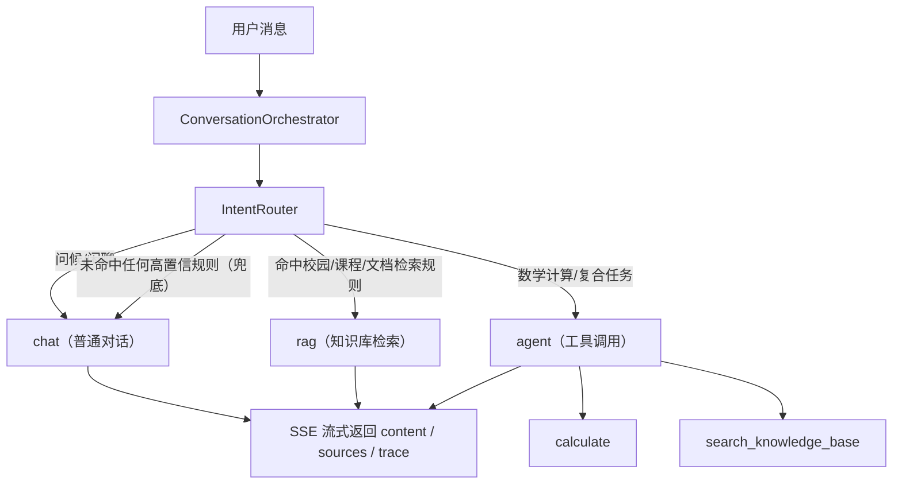
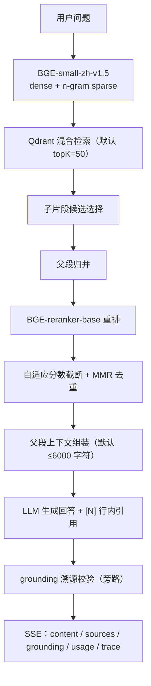

# WUT RAG Copilot / 武理小精灵

    

武理小精灵是面向武汉理工大学校园场景的 AI 助手。当前版本以 **Vue 3 + Pinia + Express + Qdrant** 为核心，通过统一会话编排层自动选择普通对话、RAG 检索或 Agent 工具调用，并以 SSE 向前端流式返回内容、来源和执行轨迹。

> 当前仓库不包含成绩、课表、考试安排等教务系统查询工具；账号体系为项目自有注册与登录。

> **知识库语料说明**：`ragdata/` 中有 14 份文档自带 `source: 模拟数据（演示用）` 标注，属于为演示检索链路而编写的虚构内容（不来自武汉理工大学官方渠道）。下文所有检索/生成指标都是在这套固定语料上测得的**技术链路表现**，不代表内容的真实性，也不应被当作校园信息参考。

## 核心能力

### 用户功能

- **流式 AI 对话**：基于 Fetch、ReadableStream 和 SSE 增量渲染回答；生产实测 SSE 首包（retrieval 事件）约 130ms。
- **自动意图路由**：后端自动决定进入 `chat`、`rag` 或 `agent`，前端无需手动切换 RAG。
- **RAG 知识库**：支持文档上传、批量录入、两级分类、统计、重索引、来源引用和反馈。
- **校园百科**：知识库文档的上架阅读视图（`/wiki`），默认不上架、管理员逐条放开，演示用虚构语料按治理规则禁止上架；分类树、目录锚点、标题与正文搜索、可读 slug 链接，并与对话来源引用双向跳转。
- **Agent 工具调用**：内置知识库检索 `search_knowledge_base`、受控工件读取 `read_tool_artifact` 与数学计算 `calculate`；大结果可按需读取。
- **文件对话与 OCR**：支持图片、PDF、DOCX、PPTX、TXT、Markdown；扫描件和图片可走视觉 OCR。
- **会话管理**：创建、切换、重命名、删除、重试、编辑重发、任意消息分叉新会话、收藏和后端持久化。
- **公开分享**：登录用户可生成只读分享快照，访问 `/share/:code` 无需登录。
- **语音交互**：浏览器支持 Web Speech API 时可实时转写；配置 StepFun TTS 后支持逐条朗读、停止播放与 AI 自动朗读。
- **评测与反馈**：包含检索评测、RAGAS、LLM-as-judge、Agent 路由评测和人工评分页面；点踩反馈可一键加入评测集候选，经 `export-badcases.cjs` 导出回流回归评测，形成线上质量闭环。
- **个性化体验**：主题、语言、头像、个人资料与用户授权记忆。

### 工程能力

- httpOnly JWT Cookie 鉴权，支持注册、登录、退出和修改密码。
- SQLite WAL 持久化存储（唯一实现）。
- Qdrant 唯一向量后端。
- Helmet、CORS 白名单、接口限流、用户配额、私有附件归属鉴权和上传文件 MIME 校验。
- 工具参数 Schema 校验、超时取消、客户端断开传播、循环检测与失败降级。
- 前端流式渲染用 requestAnimationFrame 合并高频增量更新，后台 Tab 暂停 RAF 时立即落盘待写内容；发版后旧页面的 chunk 加载失败可自动识别并恢复；Markdown Worker 以低频采样上报队列、耗时和过期结果。
- RAG 全链路可观测：traceId 贯穿 embedding、检索、重排、父段组装、生成、grounding 各阶段并记录耗时；RunEvent v1 支持序号/终态、管理员 JSONL 回放和运行级完成率/P95/工具/降级指标。
- Embedding 与 Reranker 为本地 ONNX BGE 模型（离线加载，可选 int8 量化，向量内存约省 75%），除生成环节外 RAG 链路零模型 API 调用。
- 语义缓存：精确缓存 miss 后按查询向量余弦相似度（默认 ≥0.95）复用近义问题的检索候选池，省一次向量库往返（`RAG_SEMANTIC_CACHE_ENABLED` 开启）。
- 增量重索引：重索引时按 chunk 内容 hash 对齐，未变段落直接复用已有向量，只重算新增/变化部分。
- Docker 多阶段构建、Docker Compose、GitHub Actions 和健康检查。

## 会话编排



路由原则：

1. 高置信规则优先，避免每条消息额外调用一次 LLM。
2. 只有明确命中校园/课程资料/文档检索规则时才进入 RAG；**未命中规则时默认走普通对话（chat）**，避免所有问题都触发知识库检索。RAG 无可靠来源时降级为普通模型回答。
3. Agent 决策或工具执行失败时自动降级至 RAG。
4. `INTENT_CLASSIFY_ENABLED=true` 可开启 LLM 意图分类；默认关闭以降低首包延迟。
5. `AGENT_TOOL_ENABLED=false` 可关闭工具调度并回退 RAG 链路。

Agent 默认最多执行两轮工具调度，并包含无进展循环检测。流式接口会按执行过程返回 `intent`、`tool_call`、`tool_result`、`sources`、`content` 和 `trace` 事件。

## RAG 检索链路



### 关键服务

| 服务 | 文件 | 职责 |
| --- | --- | --- |
| 会话编排 | `backend/src/services/conversation-orchestrator.service.js` | 统一处理 chat、RAG、Agent 与记忆 |
| 意图路由 | `backend/src/services/intent-router.service.js` | 快速规则、可选 LLM 分类和默认兜底 |
| Agent | `backend/src/services/agent.service.js` | 多轮工具决策、执行、收尾和轨迹输出 |
| 工具注册 | `backend/src/services/tool-registry.service.js` | Schema 校验、超时、取消和结构化结果 |
| 内置工具 | `backend/src/services/agent-tools.js` | 知识库检索与安全数学计算 |
| RAG 管道 | `backend/src/services/rag.service.js` | 管道编排、生成、trace 与降级 |
| 检索管道 | `backend/src/services/rag-retrieval.service.js` | 向量召回、父段聚合、多路检索合并 |
| Query 改写 | `backend/src/services/rag-query-rewrite.service.js` | 多轮指代/省略检测与 LLM 改写缓存 |
| 上下文组装 | `backend/src/services/rag-context-builder.service.js` | 子片段父段归并与上下文构建 |
| 排序策略 | `backend/src/services/rag-ranking.service.js` | 问题分类、自适应截断和 MMR 去重 |
| Embedding | `backend/src/services/embedding.service.js` | 本地 BGE dense 与 n-gram sparse |
| Reranker | `backend/src/services/reranker.service.js` | BGE cross-encoder 语义重排 |
| 向量存储 | `backend/src/services/vector-store-qdrant.service.js` | Qdrant collection 与混合检索 |
| 向量适配 | `backend/src/services/vector-store-qdrant.service.js` | Qdrant 独立服务（唯一后端） |

### 评测结果

检索与生成质量由 `scripts/rag-eval/` 的评测体系持续度量（数据集与评测脚本在仓库内，结果文件由 `RESULTS_DIR` 本地生成、不入库；检索基线在部署流水线中按需门控，需显式配置仓库变量 `RAG_EVAL_ENABLED=true` 才会执行）：

> 口径说明：以下指标在**含模拟数据**的知识库上测得，衡量的是检索与生成链路本身的效果，不能等同于真实校园问答的准确率。数据集中的 `relevant_doc_ids` 指向具体入库批次产生的文档 ID，在他人环境重新入库后该映射会失效——复现前请先重建映射（见「评测复现性」）。

- **检索质量**（官方评测，full-coverage 32 题，加权融合 + MMR）：Recall **97.4%**、MRR **0.977**、nDCG@5 **0.970**、HitRate **100%**。
- **融合策略消融**：RRF(k=10) 与加权融合打平（Recall 同为 97.4%，MRR/nDCG@5 微弱领先 0.007/0.004，属噪声级差异）；RRF(k=60) 因排名差异被过度压扁明显劣化（Recall 74.5%），最终默认保留加权融合。
- **MMR 消融**：修复前默认 MMR 使 Recall 降至 80.7%（相关父段被多样性排序挤出截断窗口），修复后 MMR 与关闭 MMR 均达 97.4%。
- **生成质量**（RAGAS，campus-qa 32 题，judge 模型 step-3.7-flash）：Faithfulness **91.7%**、Context Recall **81.5%**。
- **零成本防线**：grounding 句级 bigram 覆盖率校验、正则 query 分解、入库 prompt-injection 清洗均不消耗模型调用。

### 评测复现性

指标要能被别人跑出来，前提是**跑在同一个语料上**。为此仓库里固定了一份评测语料清单，作为数据集 `relevant_doc_ids` 的唯一事实来源：

| 文件 / 命令 | 作用 |
| --- | --- |
| `scripts/rag-eval/corpus-manifest.json` | 评测语料清单（标题 + 类别 + 派生 ID）。清单之外的文档都算语料外 |
| `npm run eval:corpus-check` | 校验「清单 ↔ 知识库 ↔ 数据集」三方对齐；有偏差即退出码 1 |
| `npm run eval:corpus-migrate` | 把数据集里的历史 docId 迁移到确定性 ID |

docId 由 `backend/src/utils/doc-id.js` 从 **(标题, 类别)** 确定性派生（`doc_<sha256(title\0category)[0:32]>`），所以同一份资料重新入库会得到同一个 ID，不再是一次一个随机 UUID。这也意味着同一 (标题, 类别) 的不同内容属于"覆盖"语义——重新入库会替换旧文档。

复现步骤：把 `corpus-manifest.json` 里的文档按清单标题/类别入库 → `npm run eval:corpus-check` 通过 → 再跑评测。

> **对齐状态（2026-09-26）**：数据集 ↔ 清单已完全对齐——21 处历史引用全部归一到确定性 ID（`qa.json` 的 15 处老 UUID 8 位前缀截断、`full-coverage-deploy-qa.json` 的 5 处《Agent学习笔记》更早世代 UUID `doc_daff1331-…`，后者已作为别名登记进清单 `legacyId`）。剩余偏差全在知识库侧：现库 20 篇文档全部还是改造前的随机 UUID 世代，需按清单重新入库（同内容的旧 ID 文档删除、重传后即得确定性 ID）；其中 5 篇（医疗/体育/交通指南、数据库/操作系统高频面试题）不在清单内，需先决定是补进清单还是移出知识库。`eval:corpus-check` 会把「清单内暂缺（重入库后自动对齐）」与「清单外真死引用」分开报告。

## 页面路由

| 页面 | 路由 | 权限 | 说明 |
| --- | --- | --- | --- |
| 登录与注册 | `/login` | 公开 | 自有账号注册、登录 |
| AI 对话 | `/chat` | 登录 | SSE 对话、文件、语音、会话与工具轨迹 |
| 知识库 | `/knowledge` | 登录 | 已登录用户查看；管理员上传、删除和重索引 |
| 校园百科 | `/wiki` | 登录 | 已上架词条的列表、分类树与标题/正文搜索；管理员可含未上架并上下架 |
| 百科词条 | `/wiki/:idOrSlug` | 登录 | 词条正文阅读页（目录锚点、上下篇、相关词条），支持文档 ID 或 slug |
| 评测 | `/eval` | 登录 | 人工评分、Judge 结果与系统指标 |
| 反馈看板 | `/feedback` | 管理员 | RAG 反馈分页和筛选 |
| 分享快照 | `/share/:code` | 公开只读 | 查看已生成的对话快照 |

## 主要 API

| 方法 | 路径 | 说明 |
| --- | --- | --- |
| `GET` | `/api/health` | 服务健康检查 |
| `POST` | `/api/stream` | 主 SSE 会话接口 |
| `POST` | `/api/chat/upload` | 登录用户上传私有聊天附件，返回带用户/会话归属的 `attachmentId` |
| `GET` | `/api/chat/attachments/:attachmentId` | 当前用户受控读取私有附件 |
| `POST` | `/api/auth/register` | 注册并写入认证 Cookie |
| `POST` | `/api/auth/login` | 登录并写入认证 Cookie |
| `GET` | `/api/auth/me` | 获取当前用户 |
| `GET` | `/api/conversations` | 会话列表与持久化接口 |
| `GET` | `/api/rag/documents` | 查看知识库文档 |
| `POST` | `/api/rag/documents/upload` | 管理员上传知识库文档 |
| `POST` | `/api/rag/documents/reindex` | 管理员重建索引；`mode=incremental` 走内容 hash 增量 diff，未变段落复用向量，任务互斥 |
| `GET` | `/api/wiki/entries` | 百科词条列表（默认仅已上架；`q` 匹配标题/分类/正文，`includeHidden` 仅管理员） |
| `GET` | `/api/wiki/entries/:idOrSlug` | 百科词条正文，服务端已完成 front-matter 解析、来源修订与漂移标注 |
| `GET` | `/api/wiki/entries/:docId/revisions` | 管理员查看词条来源修订历史 |
| `PUT` | `/api/wiki/entries/:docId/visibility` | 管理员上下架；演示用模拟语料默认返回 409 拒绝上架 |
| `POST` | `/api/share` | 创建分享快照 |
| `GET` | `/api/share/:code` | 公开读取分享快照 |
| `GET` | `/api/metrics/runs/:runId/events` | 管理员读取已开启的 RunEvent JSONL 回放 |
| `POST` | `/api/metrics/client-performance` | 登录用户低频上报 Markdown Worker 汇总性能 |
| `POST` | `/api/rag/documents/reindex` | 管理员重建索引；`mode=incremental` 走内容 hash 增量 diff，任务互斥 |
| `GET` | `/api/memory` | 当前未注册公开路由；记忆由会话编排层内部使用 |

## 快速开始

### 环境要求

- Node.js 20
- npm
- StepFun 或其他 OpenAI-compatible 模型服务 Key
- Docker（使用 Qdrant 或生产部署时需要）

### 安装依赖

根目录安装会通过 `postinstall` 同时安装后端依赖：

```bash
npm install
```

### 配置后端

```bash
cp backend/.env.example backend/.env
```

至少配置：

```dotenv
AI_API_KEY=your_api_key
AI_BASE_URL=https://api.stepfun.com/v1
AI_MODEL=step-3.7-flash
JWT_SECRET=replace_with_a_long_random_secret
```

配置 Qdrant（唯一向量后端）：

```dotenv
QDRANT_URL=http://localhost:6333
```

然后启动 Qdrant：

```bash
docker compose -p wuli-elf up -d qdrant
```

### 启动开发环境

终端一：

```bash
npm start
```

终端二：

```bash
npm run dev
```

- 前端：`http://localhost:5173`
- 后端：`http://localhost:3000`
- 健康检查：`http://localhost:3000/api/health`

## 常用命令

```bash
npm run dev          # 启动 Vite
npm start            # 启动 Express
npm run lint:check   # ESLint 检查
npm run lint         # ESLint 自动修复
npm test             # 日常快速测试：前后端并行，目标 60 秒内
npm run test:all     # 完整测试：包含重型存储与解析用例
npm run test:integration # 单独运行重型集成测试
npm run eval:rag-baseline   # 调用评测 API，生成 Recall/MRR/nDCG 基线
npm run build        # 生产前端构建
npm run format       # Prettier
```

RAG 与 Agent 评测脚本位于 `scripts/rag-eval/`，主要数据集位于 `scripts/rag-eval/dataset/`。

检索基线默认读取 `scripts/rag-eval/dataset/full-coverage-qa.json`，评测前需启动后端或设置 `EVAL_API_BASE` 指向可访问的评测 API；可用 `DATASET_PATH`、`RESULTS_DIR` 和 `EVAL_AUTH_TOKEN` 覆盖数据集、结果目录和认证信息。

## 环境变量

### 必填配置

| 变量 | 默认值 | 说明 |
| --- | --- | --- |
| `AI_API_KEY` | 无 | 模型服务 Key，非测试环境必须设置 |
| `JWT_SECRET` | 无 | JWT 签名密钥，非测试环境必须设置 |
| `AI_BASE_URL` | `https://api.stepfun.com/v1` | OpenAI-compatible API 地址 |
| `AI_MODEL` | `step-3.7-flash` | 主对话模型 |
| `STEPFUN_API_KEY` | 复用 StepFun `AI_API_KEY` | StepAudio TTS Key；主模型不是 StepFun 时需要单独设置 |
| `STEPFUN_TTS_MODEL` | `stepaudio-2.5-tts` | AI 回复语音合成模型 |
| `STEPFUN_TTS_VOICE` | `cixingnansheng` | TTS 官方或自定义音色 ID |
| `STEPFUN_TTS_INSTRUCTION` | 校园助手自然语气 | StepAudio 2.5 TTS 全局表演指令 |
| `STEPFUN_TTS_CACHE_ENABLED` | `true` | 是否启用进程内 TTS 缓存；敏感场景可关闭 |
| `STEPFUN_TTS_CACHE_TTL_MS` | `1800000` | TTS 内存缓存有效期，默认 30 分钟 |
| `STEPFUN_TTS_CACHE_MAX_BYTES` | `67108864` | 单实例 TTS 缓存内存上限，默认 64MB |
| `CORS_ORIGIN` | 无 | 生产跨域白名单，多个来源用逗号分隔 |

### Agent 与路由

| 变量 | 默认值 | 说明 |
| --- | --- | --- |
| `INTENT_ROUTING_ENABLED` | `true` | 启用自动路由 |
| `INTENT_CLASSIFY_ENABLED` | `false` | 启用 LLM 意图分类兜底 |
| `AGENT_TOOL_ENABLED` | `true` | 启用 Agent 工具调用 |
| `AGENT_CONTEXT_COMPACTION` | `true` | 大工具结果落盘并按需读取 |
| `AGENT_MAX_TOOL_ROUNDS` | `2` | 最大工具调度轮数 |
| `AGENT_DECIDE_TIMEOUT_MS` | `15000` | Agent 决策超时 |
| `AGENT_TOOL_TIMEOUT_MS` | `15000` | Agent 工具执行总超时 |

### RAG 与模型

| 变量 | 默认值 | 说明 |
| --- | --- | --- |
| `QDRANT_URL` | `http://localhost:6333` | Qdrant REST 地址 |
| `QDRANT_COLLECTION` | `wuli_elf_chunks` | Collection 名称 |
| `EMBEDDING_MODEL` | `Xenova/bge-small-zh-v1.5` | Embedding 模型标识 |
| `EMBEDDING_CACHE_DIR` | `.model-cache` | 本地模型缓存目录 |
| `EMBEDDING_LOCAL_FILES_ONLY` | `true` | 是否禁止运行时下载模型 |
| `EMBEDDING_BATCH_SIZE` | `16` | 单次 ONNX 前向的批大小；索引时按此分组批量推理 |
| `EMBEDDING_QUERY_INSTRUCTION` | `true` | 查询侧加 BGE 指令前缀（s2p 非对称检索）；置 `false` 可与文档侧同路径做 A/B |
| `EMBEDDING_SPARSE_IDF` | `true` | 稀疏通道用 BM25（idf + 长度归一化）。切换后文档侧权重变化，需全量重索引 |
| `RAG_HYBRID_SEARCH` | `true` | 启用 dense + sparse 混合检索 |
| `RAG_VECTOR_TOP_K` | `50` | 初始候选数 |
| `RAG_RERANK_TOP_K` | `10` | 重排后最大候选数 |
| `RAG_MAX_CONTEXT_LENGTH` | `6000` | 最大上下文字符数 |
| `RAG_MIN_SOURCE_SCORE` | `0.03` | 可靠来源最低分数 |
| `RAG_MMR_ENABLED` | `true` | 启用父段 MMR 去重 |
| `RAG_SEMANTIC_CACHE_ENABLED` | `false` | 语义缓存：近义问题按向量相似度复用检索候选池 |
| `RAG_WIKI_FIRST_ENABLED` | `true` | 启用已上架且未漂移的 Wiki 词条检索 |
| `RAG_WIKI_HYBRID_ENABLED` | `true` | Wiki 命中时是否与 Qdrant 候选合并；关闭可回退 Wiki 短路 |
| `RAG_WIKI_FIRST_MAX_ENTRIES` | `3` | Wiki 导航最多注入的词条数量 |

### 可选能力

| 变量 | 默认值 | 说明 |
| --- | --- | --- |
| `LLM_CONCURRENCY` | `3` | 同时执行的模型请求数 |
| `LLM_MAX_PENDING` | `20` | LLM 最大排队请求数，超限返回 503 |
| `LLM_QUEUE_TIMEOUT_MS` | `15000` | 排队等待超时 |
| `METRICS_PROMETHEUS_ENABLED` | `false` | 是否开启 Prometheus 抓取端点 |
| `RUN_EVENT_LOG_ENABLED` | `false` | 是否写入 RunEvent JSONL 回放日志 |
| `RUN_EVENT_LOG_INCLUDE_CONTENT` | `false` | 回放日志是否保留回答正文；默认仅保留诊断元数据 |
| `AI_FALLBACK_API_KEY` | 空 | 主模型失败时的备用 Provider |
| `AI_ENABLE_THINKING` | `false` | 是否开启模型思考模式 |
| `JUDGE_API_KEY` | `AI_API_KEY` | LLM-as-judge 独立 Key |
| `JUDGE_MODEL` | `step-3.5-flash` | Judge 模型 |
| `OCR_ENABLED` | `true` | 图片与扫描 PDF OCR |
| `OCR_MODEL` | `step-1o-turbo-vision` | OCR 视觉模型 |
| `AUTH_INVITE_CODE` | 空 | 注册邀请码；为空时不要求邀请码 |
| `ADMIN_USERNAME` | `admin` | 管理员用户名 |
| `ADMIN_PASSWORD` | 随机生成 | 生产环境应显式设置 |
| `QUOTA_DAILY_LIMIT` | `100` | 普通用户每日调用额度 |
| `QUOTA_ANONYMOUS_LIMIT` | `20` | 匿名额度 |
| 管理员额度 | 无限制 | 管理员请求由 `quotaMiddleware` 跳过每日配额；不存在 `QUOTA_ADMIN_LIMIT` 配置 |

完整模板见 `backend/.env.example` 与 `deploy/.env.production.example`。

功能清单与各功能的设计要点（含代码落点）见 [docs/FEATURES.md](docs/FEATURES.md)。

## 数据与持久化

| 数据 | 默认实现 | 容器路径 / 持久化方式 |
| --- | --- | --- |
| 用户、会话、分享、反馈、配额 | SQLite WAL | `/app/backend/data/store.db`，`backend-data` volume |
| 向量索引 | Qdrant 1.12.5 | `/qdrant/storage`，`qdrant-storage` volume |
| 上传文件 | 本地目录 + SQLite 归属元数据 | `/app/backend/uploads`，`uploads-data` volume；聊天附件按用户/会话授权并默认 7 天过期 |
| 知识库源文件 | `ragdata/` | 只读挂载到 `/app/ragdata` |
| Embedding / Reranker 模型 | `.model-cache/` | 只读挂载到 `/app/.model-cache` |

存储采用 SQLite WAL（`backend/data/store.db`），首次从旧版升级时可自动迁移旧版 `store.json` 数据。

`ragdata/` 只是部署时挂载的源文件目录，不会自动导入 SQLite，也不会自动写入或刷新 Qdrant。新增或更新知识库资料时，请通过管理端上传接口写入文档库；若文档列表存在但状态不是“可检索”，修复向量服务后重启后端（向量库就绪流程会自动重建索引），或运行 `node scripts/maintenance/rebuild-vectors.js` 手动重建。

## 项目结构

```text
.
├── src/
│   ├── api/                     # API 与 SSE 客户端
│   ├── components/              # 聊天、布局、通用和评测组件
│   ├── composables/             # 流式、Markdown、知识库等复用逻辑
│   ├── router/                  # Vue Router 与权限守卫
│   ├── stores/                  # Pinia 状态
│   ├── views/                   # Chat、Knowledge、Eval、Feedback、Share、Login
│   ├── workers/                 # Markdown Worker
│   └── __tests__/               # 前端测试
├── backend/
│   ├── src/
│   │   ├── config/              # 环境配置
│   │   ├── controllers/         # Chat 与 RAG 控制器
│   │   ├── middleware/          # 认证、安全、限流、配额
│   │   ├── routes/              # Auth、Conversation、RAG、Eval、Share、Memory
│   │   ├── services/            # 按域分子目录：rag/ llm/ agent/ knowledge/ wiki/ memory/ conversation/ observability/ media/ auth/
│   │   └── utils/               # HTTP、文本与响应工具
│   ├── __tests__/               # 后端测试
│   ├── data/                    # SQLite 数据
│   └── uploads/                 # 上传文件
├── deploy/                      # nginx、生产变量模板与部署文档
├── ragdata/                     # 知识库源文档
├── scripts/rag-eval/            # 检索、RAGAS、Agent 与性能评测
├── Dockerfile                   # 前端 + 后端多阶段镜像
├── docker-compose.yml           # backend + Qdrant 生产编排
└── README.md
```

## 测试与质量门禁

提交前建议执行：

```bash
npm run lint:check
npm test
npm run test:all
npm run build
docker compose config --quiet
```

GitHub Actions 工作流包含：

1. 安装前后端依赖。
2. ESLint、`npm audit` 和 Vitest。
3. 构建并推送提交 SHA 与 `latest` 镜像。
4. ECS 健康检查，失败时回滚上一镜像。

使用工作流前需在仓库 Settings → Secrets and variables → Actions 中配置：

1. **Variables**：`DOCKER_IMAGE_NAME`（镜像仓库地址，例如 `your-dockerhub-username/wuli-elf-backend` 或阿里云 ACR 地址），未配置时构建阶段会直接报错。
2. **Secrets**：Docker Registry 凭证（`DOCKER_USERNAME` / `DOCKER_PASSWORD`）与 ECS 连接信息（`ECS_HOST` / `ECS_USER` / `ECS_SSH_KEY`）。

## 生产部署

### 当前 Compose 结构

`docker-compose.yml` 默认管理：

- `backend`：Express API，监听宿主机 `127.0.0.1:3000`。
- `qdrant`：固定为 `qdrant/qdrant:v1.12.5`，监听宿主机 `127.0.0.1:6333-6334`。
- `backend-data`、`uploads-data`、`qdrant-storage` 三个持久化卷。

仓库中的容器 nginx 服务默认已停用。当前生产方式是宿主机 nginx 提供静态文件并反向代理 `/api`、`/uploads` 到 `127.0.0.1:3000`。

### 部署命令

```bash
cp deploy/.env.production.example deploy/.env.production
# 编辑 deploy/.env.production，至少设置 AI_API_KEY、JWT_SECRET、CORS_ORIGIN、ADMIN_PASSWORD

docker compose -p wuli-elf config --quiet
docker compose -p wuli-elf up -d qdrant backend
docker compose -p wuli-elf ps
curl http://127.0.0.1:3000/api/health
```

### 生产注意事项

- `deploy/.env.production`、`.env`、`backend/.env` 不得提交到 Git。
- `EMBEDDING_LOCAL_FILES_ONLY=true` 时，必须提前准备 `.model-cache/`。
- Qdrant 数据卷当前使用 `v1.12.5` 格式；升级镜像前必须备份并验证存储兼容性。
- `@huggingface/transformers`、ONNX Runtime、Sharp 和 better-sqlite3 包含原生依赖，受限网络环境建议在 CI 构建镜像后由服务器拉取，不建议直接在 ECS 上首次构建。
- 部署时使用提交 SHA 镜像标签，并在切换前保留旧镜像和数据备份。

更完整的 nginx、证书、CI/CD、备份和排障说明见 `deploy/README.md`。

## 项目地址

- GitHub：[L123121/Vue3_WUT_RAG](https://github.com/L123121/Vue3_WUT_RAG)
- 问题反馈：GitHub Issues
